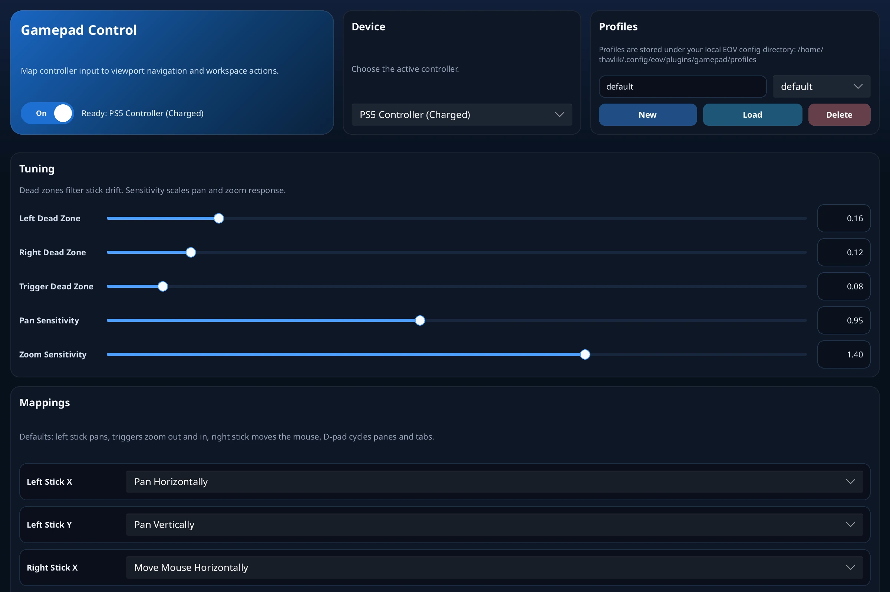

# Gamepad Plugin for eov

[](https://github.com/eosin-platform/eov-gamepad-plugin/actions/workflows/release.yml)
[](https://github.com/eosin-platform/eov-gamepad-plugin#license)

This repository contains the Gamepad plugin for [eov](https://github.com/eosin-platform/eov), the lightweight whole-slide image viewer. The plugin adds controller-driven viewport navigation, workspace actions, and a dedicated settings window for tuning mappings, sensitivity, and saved controller profiles.

The host application is documented in the main eov repository. This README covers the plugin itself: what it does, how it behaves today, and how to build and package it for eov.

Prebuilt `.eop` release artifacts are published for Linux, macOS, and Windows across `x86_64` and `arm64` where GitHub-hosted runners are available.

## Screenshots

<p align="center">
	
</p>

## What It Does

The plugin extends eov with:

- Controller-driven viewport panning
- Controller-driven zoom
- Optional controller-driven mouse movement
- Gamepad shortcuts for pane, tab, and series navigation
- A dedicated settings window opened from the toolbar
- Per-controller selection when multiple devices are connected
- Adjustable dead zones for sticks and triggers
- Adjustable pan and zoom sensitivity
- Named mapping profiles saved as JSON
- Profile import from external JSON files

The plugin is designed so the controller can handle both direct viewport motion and higher-level workspace actions without adding a separate in-viewport overlay or HUD surface.

## Current User-Facing Behavior

When the plugin is loaded into eov, it contributes one toolbar button:

- `Gamepad` (): opens or closes the gamepad settings window

The window is a runtime-loaded Slint UI hosted by eov. It is wider than the standard plugin window size because it exposes both tuning controls and a full mapping table.

### Controller State

The header card shows whether controller input is enabled and reports the currently selected device status.

- If no supported controller is connected, the window shows `Waiting for a controller`.
- If a supported controller is connected, the status updates to `Ready: ...` with the detected device label.
- If controller input is paused, the status changes to `Controller paused: ...`.

The plugin filters the device list to controllers that expose the minimum inputs it needs for the default workflow. It has been tested with:

- PS5 DualSense
- Xbox Elite controllers

If your gamepad is not detected or behaves incorrectly, please open an issue with the controller model, operating system, and whether you are using X11, Wayland, or Windows.

### Default Mappings

The default profile is oriented around slide navigation and light workspace control:

- `Left Stick X/Y`: pan horizontally and vertically
- `Right Stick X/Y`: move the mouse cursor
- `Left Trigger`: zoom out
- `Right Trigger`: zoom in
- `D-Pad Left/Right`: previous or next pane
- `D-Pad Up/Down`: previous or next tab
- `North Button`: toggle the series bar
- `Left Shoulder`: previous series item
- `Right Shoulder`: next series item
- `South Button`: open the selected series item

Every mapped control can be reassigned from the settings window. Axis controls and button controls expose separate action menus so the UI only shows actions that make sense for that input type.

### Device Selection

If multiple supported controllers are connected, the `Device` card lets you choose which one drives eov. The selected device is kept as the preferred device while it remains available.

If no supported device is detected, the selector is replaced with a `No controllers detected` empty state.

### Profiles

Profiles store dead zones, sensitivities, and the full control mapping table.

- `New` resets the window to plugin defaults and saves a new profile name such as `untitled` or `untitled-2`.
- The profile combo box loads one of the saved local profiles.
- The `Load` button imports a profile from a JSON file chosen through the host file picker.
- `Delete` removes the currently named local profile.

Any mapping or numeric tuning change is persisted immediately and also written back to the current profile name when one is set.

### Tuning

The settings window exposes five numeric controls:

- Left stick dead zone
- Right stick dead zone
- Trigger dead zone
- Pan sensitivity
- Zoom sensitivity

Each setting can be edited either as a numeric text field or with the inline slider. Slider double-click resets the field to its built-in default value.

### Mouse Control

By default, the right stick drives relative mouse motion. This is useful for desktop-level interactions that are not directly exposed through the host controller actions.

On Linux Wayland sessions, the plugin first tries to use the XDG desktop portal remote desktop API for pointer motion. That may prompt for permission the first time mouse control is used. If portal-based pointer access is unavailable, the plugin falls back to `enigo` backends where possible.

## Storage Model

The plugin stores its runtime state and saved profiles under the local eov config directory.

Files used today:

- `plugins/gamepad/state.json`: last active tuning values and mappings
- `plugins/gamepad/profiles/*.json`: named saved profiles

On Linux this resolves under `~/.config/eov/plugins/gamepad/` unless `XDG_CONFIG_HOME` is set.

Profile files are plain JSON and can be imported through the settings window.

## Scope and Limitations

The current implementation is intentionally narrow.

Implemented today:

- Controller-driven viewport panning and zoom
- Controller-driven mouse motion
- Pane, tab, and series navigation actions
- Local JSON profile storage and import
- Per-device selection inside the settings window

Not implemented by this plugin today:

- Viewport overlays
- Viewport context menu actions
- HUD toolbar controls
- Automatic per-controller profile switching
- Force feedback or haptics
- Button chord support
- Exporting profiles from the UI

Controller support is based on what `gilrs` exposes for the platform and how the device reports its buttons and axes. Unsupported or partially mapped controllers may still require upstream mapping improvements or plugin-side handling.

## Building

This is a Rust plugin crate built as a dynamic library.

Build it from the plugin repository:

```bash
cargo build
```

Or from the host repository root:

```bash
cargo build --manifest-path plugins/gamepad/Cargo.toml
```

The produced shared library must be packaged together with `plugin.toml` and the `ui/` directory before eov can discover it.

## Packaging for eov

Recent eov builds discover plugins from packaged `.eop` tarballs placed in the configured plugin directory. By default that directory is:

```text
~/.eov/plugins/
```

For this plugin, the package should contain at least:

- `plugin.toml`
- the compiled shared library for the target platform
- `ui/gamepad-window.slint`
- the rest of the `ui/` assets used by the window

This repository includes a helper packager:

```bash
python3 scripts/package_eop.py \
  --plugin-root . \
  --library target/debug/libgamepad.so \
  --output ~/.eov/plugins/gamepad.eop
```

If you are working inside the main eov repository, you can also build the plugin from the workspace root and then package it with the same helper by pointing `--plugin-root` at `plugins/gamepad`.

## Using the Plugin in eov

1. Start eov with the plugin available in its plugin directory.
2. Click `Gamepad` in the toolbar to open the settings window.
3. Connect a supported controller and select it if more than one is available.
4. Leave the defaults in place or tune dead zones, sensitivities, and mappings.
5. Save a named profile for the controller layout you want to keep.
6. Use the controller to pan, zoom, navigate panes or tabs, and move through the series bar.

## Repository Layout

```text
.
├── Cargo.toml
├── plugin.toml
├── images/
│   └── gamepad-settings-window.webp
├── scripts/
│   └── package_eop.py
├── src/
│   ├── lib.rs
│   ├── state.rs
│   └── window.rs
└── ui/
    ├── gamepad-window.slint
    └── icons/
```

Key pieces:

- `src/lib.rs`: plugin FFI entrypoints and toolbar registration
- `src/state.rs`: controller polling, action dispatch, persistence, and defaults
- `src/window.rs`: settings window callbacks and property bridging
- `ui/`: runtime-loaded Slint settings window

## Development Notes

- The plugin is a Rust FFI plugin using the eov `plugin_api` crate.
- Its primary UI surface is a standalone plugin window rather than a docked sidebar.
- The worker thread uses `gilrs` for controller input.
- Mouse movement uses `enigo`, with Linux Wayland portal support through `ashpd` when available.
- The host application handles plugin window sizing and refresh for the gamepad window.

## License

This repository is tri-licensed under:

- MIT
- Apache-2.0
- GPL-3.0

See the license files in this repository for the full text.